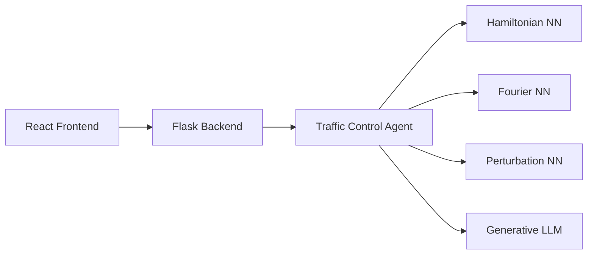

# Multi-Agent AI Architecture Demonstration


## Overview
This project demonstrates a multi-agent AI architecture through the implementation of a time series analysis system. It showcases different neural network paradigms, agent coordination patterns, and modern microservices architecture. The system integrates physics-inspired neural networks with generative AI to illustrate various approaches to AI system design.

### Educational Purpose
- Demonstrate different neural network architectures working together
- Showcase multi-agent system coordination
- Illustrate modern microservices patterns
- Present real-world AI model collaboration strategies

## Architecture



### Components
- **Frontend**: React-based dashboard for visualization and interaction
- **Backend**: Flask service with REST API
- **Traffic Control Agent**: Orchestrates multiple AI agents via gRPC
- **AI Agents**:
  - Hamiltonian Neural Network: Conservation law modeling
  - Fourier Neural Network: Frequency domain analysis
  - Perturbation Theory Neural Network: Regime change detection
  - Generative LLM: Natural language integration and explanation

## Getting Started

### Prerequisites
- Python 3.9+
- Node.js 14+
- Docker and Docker Compose
- Git

### Installation

1. Clone the repository:
```bash
git clone [your-repo-url]
cd [repo-name]
```

2. Set up Python virtual environment:
```bash
python -m venv .venv
source .venv/bin/activate  # On Windows: .venv\Scripts\activate
pip install -r requirements.txt
```

3. Install frontend dependencies:
```bash
cd services/client_service/frontend
npm install
```

4. Build and run with Docker:
```bash
./setup.sh
docker-compose up
```
## Environment Setup

This project requires certain environment variables to be set. To configure:

1. Copy the environment template:
   ```bash
   cp .env.template .env
   ```

## Usage

### Running the System
1. Start the services:
```bash
./run_app.sh
```

2. Access the dashboard:
```
http://localhost:3000
```

### Running Tests
```bash
./run_tests.sh
```

## Project Structure
```
├── services/
│   ├── client_service/     # Frontend and Backend
│   ├── tca_service/        # Traffic Control Agent
│   ├── hamiltonian_agent/  # Hamiltonian NN Service
│   ├── fourier_agent/      # Fourier NN Service
│   ├── perturbation_agent/ # Perturbation Theory NN
│   └── generative_agent/   # LLM Service
├── models/                 # Neural Network Implementations
├── tests/                  # Test Suite
├── utils/                  # Utility Functions
└── protos/                # gRPC Protocol Definitions
```

## Educational Components

### Neural Network Approaches
- **Hamiltonian NN**: Models system dynamics using energy conservation principles
- **Fourier NN**: Analyzes frequency components and periodic patterns
- **Perturbation NN**: Detects and analyzes system regime changes
- **Generative LLM**: Provides natural language analysis and explanations

### Agent Coordination Patterns
- Round-robin distribution
- Capability-based routing
- Confidence-weighted aggregation
- Ensemble methods

## Development

### Adding New Agents
1. Create new directory under `services/`
2. Define gRPC protocol in `protos/`
3. Implement agent interface
4. Register with Traffic Control Agent

### Modifying the Frontend
1. Navigate to `services/client_service/frontend`
2. Make changes to React components
3. Test using `npm test`
4. Build using `npm run build`

## Contributing
Contributions are welcome! Please read our [Contributing Guidelines](CONTRIBUTING.md) for details on our code of conduct and the process for submitting pull requests.

## Future Enhancements
- Additional neural network architectures
- Enhanced visualization components
- More agent coordination patterns
- Extended educational documentation

## License
This project is licensed under the MIT License - see the [LICENSE](LICENSE) file for details.

## Acknowledgments
- Neural network implementations inspired by physics-based modeling
- Multi-agent architecture patterns from distributed systems design
- Modern microservices practices

## Contact
Braun Brelin
braun.brelin@ai-elevate.ai

## Disclaimer
This project is for educational and demonstration purposes only. It is not intended for production use or real-world financial applications.
foo bar baz
