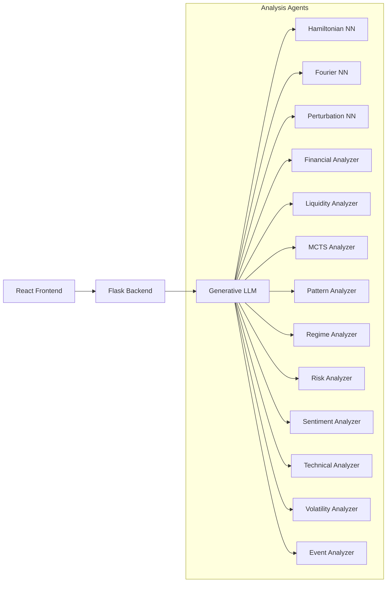
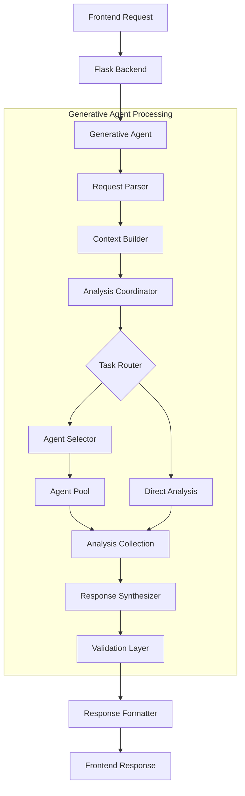

i# Multi-Agent AI Architecture Demonstration


## Overview
This project implements a sophisticated financial analysis system through a multi-agent AI architecture. It combines specialized market analyzers, physics-inspired neural networks, and a central generative AI agent that coordinates analysis and provides comprehensive financial insights. The system demonstrates advanced agent coordination patterns while delivering practical financial analysis.

### Educational Purpose
- Demonstrate different neural network architectures working together
- Showcase intelligent agent coordination through generative AI
- Illustrate modern microservices patterns
- Present real-world AI model collaboration strategies

## Architecture



### Data Flow


### Components
- **Frontend**: React-based dashboard for visualization and interaction
- **Backend**: Flask service with REST API
- **Generative LLM Agent**: 
  - Coordinates all analysis activities
  - Routes requests to specialized agents
  - Synthesizes comprehensive responses
  - Provides natural language explanations
- **Physics-Based AI Agents**:
  - Hamiltonian Neural Network: Conservation law modeling
  - Fourier Neural Network: Frequency domain analysis
  - Perturbation Theory Neural Network: Regime change detection
- **Financial Analysis Agents**:
  - Financial Analyzer: Core financial metrics and valuation models
  - Liquidity Analyzer: Market depth and trading volume assessment
  - MCTS Analyzer: Monte Carlo Tree Search for scenario exploration
  - Pattern Analyzer: Technical pattern recognition and validation
  - Regime Analyzer: Market state and regime change detection
  - Risk Analyzer: Comprehensive risk metrics and assessment
  - Sentiment Analyzer: Market sentiment evaluation using multiple sources
  - Technical Analyzer: Technical indicators and trend analysis
  - Volatility Analyzer: Advanced volatility modeling and forecasting
  - Event Impact Analyzer: Corporate and market event analysis

## Getting Started

### Prerequisites
- Python 3.9+
- Node.js 14+
- Docker and Docker Compose
- Git

### Installation

1. Clone the repository:
```bash
git clone [your-repo-url]
cd [repo-name]
```

2. Set up Python virtual environment:
```bash
python -m venv .venv
source .venv/bin/activate  # On Windows: .venv\Scripts\activate
pip install -r requirements.txt
```

3. Install frontend dependencies:
```bash
cd services/client_service/frontend
npm install
```

4. Build and run with Docker:
```bash
./setup.sh
docker-compose up
```

## Environment Setup

This project requires certain environment variables to be set. To configure:

1. Copy the environment template:
```bash
cp .env.template .env
```

## Usage

### Running the System
1. Start the services:
```bash
./run_app.sh
```

2. Access the dashboard:
```
http://localhost:3000
```

### Running Tests
```bash
./run_tests.sh
```

## Project Structure
```
├── services/
│   ├── client_service/     # Frontend and Backend
│   ├── generative_agent/   # Main Coordination and LLM Service
│   ├── hamiltonian_agent/  # Hamiltonian NN Service
│   ├── fourier_agent/      # Fourier NN Service
│   └── perturbation_agent/ # Perturbation Theory NN
├── models/                 # Neural Network Implementations
├── tests/                  # Test Suite
├── utils/                  # Utility Functions
└── protos/                # gRPC Protocol Definitions
```

## Educational Components

### Neural Network Approaches
- **Hamiltonian NN**: Models system dynamics using energy conservation principles
- **Fourier NN**: Analyzes frequency components and periodic patterns
- **Perturbation NN**: Detects and analyzes system regime changes

### Agent Coordination Patterns
The generative agent implements:
- Dynamic request routing
- Capability-based analysis distribution
- Confidence-weighted result aggregation
- Intelligent response synthesis

## Generative AI Agent

### Request Processing Flow
1. **Request Parsing**: Analyzes incoming requests for intent and requirements
2. **Context Building**: Constructs analysis context from request and market state
3. **Analysis Coordination**: 
   - Routes tasks to appropriate analyzers
   - Manages parallel analysis streams
   - Aggregates results
4. **Response Synthesis**: 
   - Combines analysis results
   - Generates natural language explanations
   - Validates conclusions
   - Formats response for frontend

[Previous Prompt System Architecture section remains the same]

### Prompt Structure

[Previous mermaid diagrams for Prompt System Architecture remain the same]

### Development

### Adding New Agents
1. Create new directory under `services/`
2. Define gRPC protocol in `protos/`
3. Implement agent interface
4. Register with Generative Agent

### Modifying the Frontend
1. Navigate to `services/client_service/frontend`
2. Make changes to React components
3. Test using `npm test`
4. Build using `npm run build`

## Contributing
Contributions are welcome! Please read our [Contributing Guidelines](CONTRIBUTING.md) for details on our code of conduct and the process for submitting pull requests.

## Future Enhancements
- Additional neural network architectures
- Enhanced visualization components
- Extended agent coordination capabilities
- Expanded educational documentation

## License
This project is licensed under the MIT License - see the [LICENSE](LICENSE) file for details.

## Acknowledgments
- Neural network implementations inspired by physics-based modeling
- Multi-agent architecture patterns from distributed systems design
- Modern microservices practices

## Contact
Braun Brelin
braun.brelin@ai-elevate.ai

## Disclaimer
This project is for educational and demonstration purposes only. It is not intended for production use or real-world financial applications.
